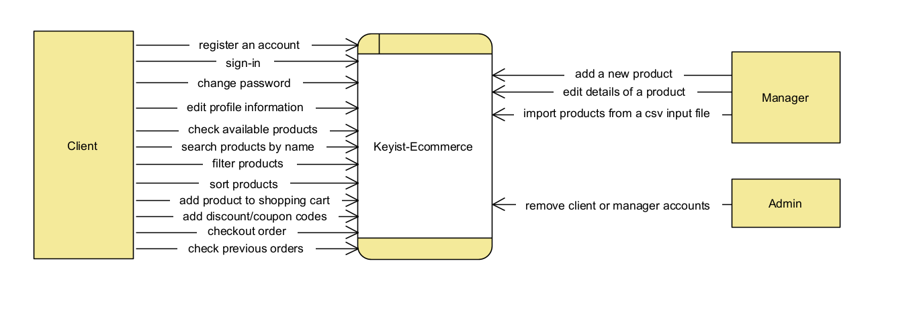

# Global Report

## Requirements

[Read More](./RequirementsSpecification.md)

## Domain Model

## Architecture Diagram

## Logical View

## DFD Level 0

## OWASP Threat Dragon

[Read More](./Data%20Diagram%20Flows%20Report/OWASP%20Threat%20Dragon.pdf)

## Abuse Cases

[Read More](./AbuseCases.md)

## Red Hat Dependency Analysis

[Resource Server](./RedHat/resource_serverDependencyAnalysisReport.html)

[Authorization Server](./RedHat/auth_serverDependencyAnalyticsReport.html)
